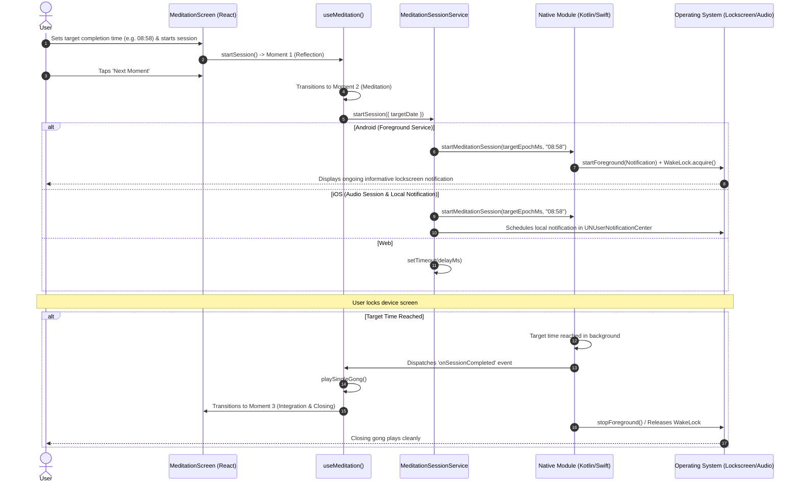

# Welcome to your Expo app 👋

This is an [Expo](https://expo.dev) project created with [`create-expo-app`](https://www.npmjs.com/package/create-expo-app).

## Get started

1. Install dependencies

   ```bash
   bun install
   ```

2. Start the app

   ```bash
   bun run start
   ```

In the output, you'll find options to open the app in a

- [development build](https://docs.expo.dev/develop/development-builds/introduction/)
- [Android emulator](https://docs.expo.dev/workflow/android-studio-emulator/)
- [iOS simulator](https://docs.expo.dev/workflow/ios-simulator/)
- [Expo Go](https://expo.dev/go), a limited sandbox for trying out app development with Expo

You can start developing by editing the files inside the **app** directory. This project uses [file-based routing](https://docs.expo.dev/router/introduction).

## Project Setup & Quality

- To lint the project, run `bunx expo lint`
- To typecheck the project, run `bunx tsc --noEmit`
- To run quality checks and build diagnostics, run `make check`

---

## Meditation Session Architecture (Multiplatform SDD)

Software Design Document (SDD) specifying session lifecycle, background execution, and lockscreen notifications across Android, iOS, and Web.

```
                    ┌─────────────────────────────────────────┐
                    │          UI / Presentation Layer        │
                    │        src/app/(tabs)/meditation.tsx    │
                    └────────────────────┬────────────────────┘
                                         │
                                         ▼
                    ┌─────────────────────────────────────────┐
                    │               Custom Hook               │
                    │         src/hooks/use-meditation.ts     │
                    └────────────────────┬────────────────────┘
                                         │ (Consumes Contract)
                                         ▼
                    ┌─────────────────────────────────────────┐
                    │        IMeditationSessionService        │
                    │   src/services/meditation-session/types │
                    └────────────────────┬────────────────────┘
                                         │
               ┌─────────────────────────┼─────────────────────────┐
               ▼                         ▼                         ▼
      ┌─────────────────┐       ┌─────────────────┐       ┌─────────────────┐
      │ AndroidStrategy │       │   IosStrategy   │       │   WebStrategy   │
      └────────┬────────┘       └────────┬────────┘       └────────┬────────┘
               │                         │                         │
               ▼                         ▼                         ▼
   ┌───────────────────────┐ ┌───────────────────────┐ ┌───────────────────────┐
   │ modules/meditation-   │ │ modules/meditation-   │ │ Window Timers         │
   │ session (Kotlin)      │ │ session (Swift)       │ │ & Web Audio API       │
   │ ForegroundService     │ │ AVAudioSession        │ │                       │
   │ + Partial WakeLock    │ │ + UNNotificationCtr   │ │                       │
   └───────────────────────┘ └───────────────────────┘ └───────────────────────┘
```

### 1. Design & Domain Principles

- **Single Source of Truth**: The `SessionParams` domain model accepts only `targetDate: Date`. All remaining time calculations and display formatting are derived internally within each strategy.
- **Dependency Inversion Principle (DIP)**: The presentation layer and `useMeditation` hook are fully decoupled from platform-specific APIs.
- **Non-Interactive Lockscreen Display**: The lockscreen notification is purely informative, containing no media control buttons (play/pause/skip) to preserve an uninterrupted, introspective experience.
- **Doze Mode Immunity (Android)**: The CPU remains active via a native partial `WakeLock` held by a dedicated Android Foreground Service.

### 2. Session Lifecycle Sequence Diagram



### 3. Detailed Platform Implementations

#### A. Android (`modules/meditation-session/android`)

* **`MeditationForegroundService.kt`**:
  * Foreground Service Type: `android:foregroundServiceType="mediaPlayback"`.
  * **Partial WakeLock**: Acquires `PowerManager.PARTIAL_WAKE_LOCK` with a safety timeout, ensuring the CPU is never suspended by Android Doze Mode during active meditation.
  * **Persistent Notification**: Constructed using `NotificationCompat.Builder`:
    * `ongoing = true` and `visibility = NotificationCompat.VISIBILITY_PUBLIC`.
    * Title: *"Meditación en curso"*.
    * Subtitle: *"Momento 2 · Finaliza a las HH:mm"*.
    * **No Interactive Actions**: Excludes play/pause/skip actions.
  * **Native Timer**: Kotlin coroutine on `Dispatchers.Default` using `delay(remainingMs)`. Upon completion, invokes `onSessionCompletedListener` and terminates with `stopSelf()`.
* **`MeditationSessionModule.kt`**:
  * Expo Modules API implementation under namespace `org.masch.myself.meditationsession`.
  * Exposes `startSession`, `stopSession`, `isSessionActive` and emits `onSessionCompleted`.

#### B. iOS (`modules/meditation-session/ios`)

* **`MeditationSessionModule.swift`**:
  * Manages countdown timers on the main thread via `Timer.scheduledTimer`.
  * Dispatches `onSessionCompleted` events to JavaScript.
* **`IosMeditationSessionService.ts`**:
  * Configures background audio category (`AVAudioSession.playback`).
  * Schedules local notification in `UNUserNotificationCenter` as an OS-level fallback.

#### C. Web (`src/services/meditation-session/web-strategy.ts`)

* Uses browser `setTimeout` timers and Web Notification API.
* **Lazy Loading & Safe Fallbacks**:
  * `MeditationSessionModule.web.ts` provides a mock module registered via `registerWebModule`.
  * `index.web.ts` and `LazyMeditationSessionService` guarantee that Metro web bundlers never execute native binary calls.

#### D. Do Not Disturb Module (`modules/dnd-status`)

* Queries and manages Android DND state via `NotificationManager.currentInterruptionFilter` and `NotificationManager.setInterruptionFilter()`, backed by `ACCESS_NOTIFICATION_POLICY` permission under namespace `org.masch.myself.dndstatus`.

---