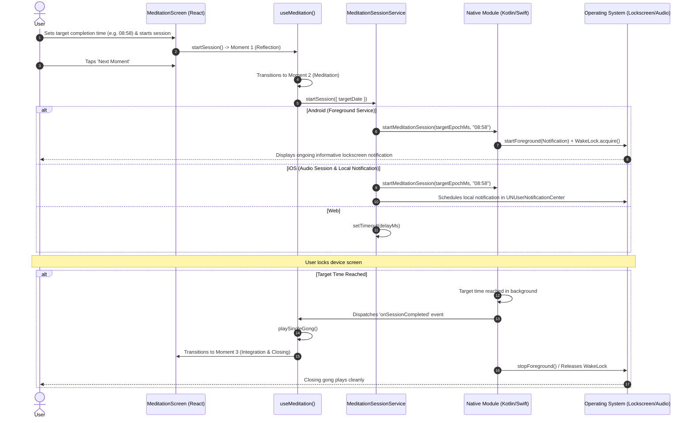
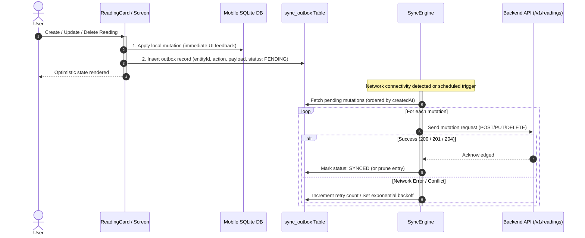

# Welcome to your Expo app 👋

This is an [Expo](https://expo.dev) project created with [`create-expo-app`](https://www.npmjs.com/package/create-expo-app).

## Get started

1. Install dependencies

   ```bash
   bun install
   ```

2. Start the app

   ```bash
   bun run start
   ```

In the output, you'll find options to open the app in a

- [development build](https://docs.expo.dev/develop/development-builds/introduction/)
- [Android emulator](https://docs.expo.dev/workflow/android-studio-emulator/)
- [iOS simulator](https://docs.expo.dev/workflow/ios-simulator/)
- [Expo Go](https://expo.dev/go), a limited sandbox for trying out app development with Expo

You can start developing by editing the files inside the **app** directory. This project uses [file-based routing](https://docs.expo.dev/router/introduction).

## Project Setup & Quality

- To check code formatting: `make check-format` (or `bun run check:format`)
- To check linting: `make check-lint` (or `bun run check:lint`)
- To check types: `make check-types` (or `bun run check:types`)
- To check tests: `make check-tests` (or `bun run check:test`)
- To check Expo dependencies: `make check-doctor`
- To check only changed packages against main: `make check-affected`
- To check a single workspace: `make check-api`, `make check-mobile`, or `make check-shared`
- To run the full quality check suite in parallel: `make check`
- To auto-format the whole codebase: `make fix-format` (or `make fix`)
- To auto-format git-staged files: `make fix-format-staged`

---

## Meditation Session Architecture (Multiplatform SDD)

Software Design Document (SDD) specifying session lifecycle, background execution, and lockscreen notifications across Android, iOS, and Web.

```
                    ┌─────────────────────────────────────────┐
                    │          UI / Presentation Layer        │
                    │        src/app/(tabs)/meditation.tsx    │
                    └────────────────────┬────────────────────┘
                                         │
                                         ▼
                    ┌─────────────────────────────────────────┐
                    │               Custom Hook               │
                    │         src/hooks/use-meditation.ts     │
                    └────────────────────┬────────────────────┘
                                         │ (Consumes Contract)
                                         ▼
                    ┌─────────────────────────────────────────┐
                    │        IMeditationSessionService        │
                    │   src/services/meditation-session/types │
                    └────────────────────┬────────────────────┘
                                         │
               ┌─────────────────────────┼─────────────────────────┐
               ▼                         ▼                         ▼
      ┌─────────────────┐       ┌─────────────────┐       ┌─────────────────┐
      │ AndroidStrategy │       │   IosStrategy   │       │   WebStrategy   │
      └────────┬────────┘       └────────┬────────┘       └────────┬────────┘
               │                         │                         │
               ▼                         ▼                         ▼
   ┌───────────────────────┐ ┌───────────────────────┐ ┌───────────────────────┐
   │ modules/meditation-   │ │ modules/meditation-   │ │ Window Timers         │
   │ session (Kotlin)      │ │ session (Swift)       │ │ & Web Audio API       │
   │ ForegroundService     │ │ AVAudioSession        │ │                       │
   │ + Partial WakeLock    │ │ + UNNotificationCtr   │ │                       │
   └───────────────────────┘ └───────────────────────┘ └───────────────────────┘
```

### 1. Design & Domain Principles

- **Single Source of Truth**: The `SessionParams` domain model accepts only `targetDate: Date`. All remaining time calculations and display formatting are derived internally within each strategy.
- **Dependency Inversion Principle (DIP)**: The presentation layer and `useMeditation` hook are fully decoupled from platform-specific APIs.
- **Non-Interactive Lockscreen Display**: The lockscreen notification is purely informative, containing no media control buttons (play/pause/skip) to preserve an uninterrupted, introspective experience.
- **Doze Mode Immunity (Android)**: The CPU remains active via a native partial `WakeLock` held by a dedicated Android Foreground Service.

### 2. Session Lifecycle Sequence Diagram



### 3. Detailed Platform Implementations

#### A. Android (`modules/meditation-session/android`)

- **`MeditationForegroundService.kt`**:
  - Foreground Service Type: `android:foregroundServiceType="mediaPlayback"`.
  - **Partial WakeLock**: Acquires `PowerManager.PARTIAL_WAKE_LOCK` with a safety timeout, ensuring the CPU is never suspended by Android Doze Mode during active meditation.
  - **Persistent Notification**: Constructed using `NotificationCompat.Builder`:
    - `ongoing = true` and `visibility = NotificationCompat.VISIBILITY_PUBLIC`.
    - Title: _"Meditación en curso"_.
    - Subtitle: _"Momento 2 · Finaliza a las HH:mm"_.
    - **No Interactive Actions**: Excludes play/pause/skip actions.
  - **Native Timer**: Kotlin coroutine on `Dispatchers.Default` using `delay(remainingMs)`. Upon completion, invokes `onSessionCompletedListener` and terminates with `stopSelf()`.
- **`MeditationSessionModule.kt`**:
  - Expo Modules API implementation under namespace `org.masch.myself.meditationsession`.
  - Exposes `startSession`, `stopSession`, `isSessionActive` and emits `onSessionCompleted`.

#### B. iOS (`modules/meditation-session/ios`)

- **`MeditationSessionModule.swift`**:
  - Manages countdown timers on the main thread via `Timer.scheduledTimer`.
  - Dispatches `onSessionCompleted` events to JavaScript.
- **`IosMeditationSessionService.ts`**:
  - Configures background audio category (`AVAudioSession.playback`).
  - Schedules local notification in `UNUserNotificationCenter` as an OS-level fallback.

#### C. Web (`src/services/meditation-session/web-strategy.ts`)

- Uses browser `setTimeout` timers and Web Notification API.
- **Lazy Loading & Safe Fallbacks**:
  - `MeditationSessionModule.web.ts` provides a mock module registered via `registerWebModule`.
  - `index.web.ts` and `LazyMeditationSessionService` guarantee that Metro web bundlers never execute native binary calls.

#### D. Do Not Disturb Module (`modules/dnd-status`)

- Queries and manages Android DND state via `NotificationManager.currentInterruptionFilter` and `NotificationManager.setInterruptionFilter()`, backed by `ACCESS_NOTIFICATION_POLICY` permission under namespace `org.masch.myself.dndstatus`.

---

## Meditation Readings Architecture (Hexagonal Domain & Offline Outbox)

Architectural design of the CRUD and synchronization engine for meditation readings across the monorepo packages (`packages/shared`, `apps/api`, and `apps/mobile`).

```
                              ┌─────────────────────────────────────────────────────────┐
                              │               Domain Layer (Shared Kernel)              │
                              │                  packages/shared/src/domain             │
                              │  - Entities: Reading, Author, User                      │
                              │  - Invariant Schemas: readingPropsSchema                │
                              │  - Ports: ReadingRepositoryPort, AuthorRepositoryPort    │
                              └───────────────────────────┬─────────────────────────────┘
                                                          │
                                         Implements Ports │ Consumes Contracts
                                                          ▼
             ┌────────────────────────────────────────────┴────────────────────────────────────────────┐
             ▼                                                                                         ▼
┌─────────────────────────────────────────┐                               ┌─────────────────────────────────────────┐
│          Backend API (Hexagonal)        │                               │       Mobile Client (Offline First)     │
│                 apps/api                │                               │               apps/mobile               │
├─────────────────────────────────────────┤                               ├─────────────────────────────────────────┤
│ [Driving / Inbound]                     │                               │ [Presentation / UI Components]          │
│ - Hono Routes: /v1/readings (CRUD)      │                               │ - Screens: ReadingsScreen, ReadingDetail│
│                                         │                               │ - Components: ReadingCard, AppIcon      │
│ [Application Services]                  │                               │                                         │
│ - ReadingService, AuthorService         │                               │ [State & Hooks]                         │
│   (Business rules & port orchestration) │                               │ - useReadingsQuery (TanStack / Local)   │
│                                         │                               │                                         │
│ [Driven / Outbound Adapters]            │                               │ [Local Persistence & Outbox]            │
│ - SQLite/Drizzle Repositories           │                               │ - SQLite / Drizzle Client               │
│ - Mappers: ReadingMapper, AuthorMapper  │                               │ - sync_outbox (Mutations queue)         │
│   (Pure Domain <-> DB schema conversion)│                               │                                         │
│                                         │                               │ [Sync Engine]                           │
│                                         │◄────── HTTP / Sync Batch ─────┤ - SyncEngine (Flush outbox, resolve     │
│                                         │                               │   conflicts, update sync status)        │
└─────────────────────────────────────────┘                               └─────────────────────────────────────────┘
```

### 1. Layers & Responsibilities

| Layer                          | Location                                        | Primary Responsibilities                                                                                                                                                                              | Dependencies                                      |
| ------------------------------ | ----------------------------------------------- | ----------------------------------------------------------------------------------------------------------------------------------------------------------------------------------------------------- | ------------------------------------------------- |
| **Domain (Shared Kernel)**     | `packages/shared/src/domain/`                   | Encapsulates enterprise business rules, entity models (`Reading`, `Author`, `User`), domain invariants validated via Zod schemas, and repository interface ports (`ReadingRepositoryPort`).           | Zero external frameworks (pure TypeScript + Zod). |
| **Application Services (API)** | `apps/api/src/services/`                        | Implements use cases (create, update, delete, retrieve readings). Coordinates business flow and enforces domain validations using repository ports.                                                   | Depends only on Domain ports and entities.        |
| **Persistence Adapters (API)** | `apps/api/src/adapters/persistence/sqlite/`     | Implements repository ports backed by SQLite/LibSQL and Drizzle ORM. Bidirectional mappers (`ReadingMapper`, `AuthorMapper`, `UserMapper`) isolate database record schemas from pure domain entities. | Implements Domain ports.                          |
| **HTTP Routing (API)**         | `apps/api/src/routes/`                          | Exposes RESTful endpoints (`/v1/readings`, `/v1/authors`). Validates request bodies against shared schemas and translates HTTP requests into service calls.                                           | Hono framework, Application Services.             |
| **Mobile Offline & Outbox**    | `apps/mobile/src/core/sync/`                    | Manages local SQLite storage and an atomic mutation outbox (`sync_outbox`). Local actions commit immediately to disk and queue events (`CREATE`, `UPDATE`, `DELETE`).                                 | Expo SQLite, Drizzle ORM, Shared Domain.          |
| **Mobile Sync Engine**         | `apps/mobile/src/core/sync/sync-engine.ts`      | Periodically drains the outbox to the remote API, processes server updates, handles connection status changes, and manages retry backoff and idempotency.                                             | API Client, Network connectivity state.           |
| **Mobile Presentation**        | `apps/mobile/src/features/readings/components/` | Modular UI components (`ReadingCard`, `AppIcon`) designed with atomic patterns and cross-platform icon fallbacks.                                                                                     | React Native, Expo Router.                        |

### 2. Offline-First Synchronization Lifecycle


