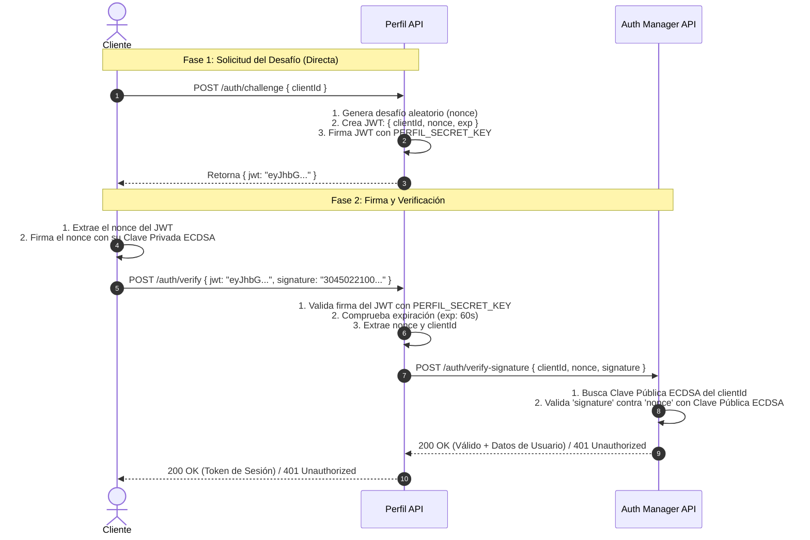

# Welcome to your Expo app 👋

This is an [Expo](https://expo.dev) project created with [`create-expo-app`](https://www.npmjs.com/package/create-expo-app).

## Get started

1. Install dependencies

   ```bash
   npm install
   ```

2. Start the app

   ```bash
   npx expo start
   ```

In the output, you'll find options to open the app in a

- [development build](https://docs.expo.dev/develop/development-builds/introduction/)
- [Android emulator](https://docs.expo.dev/workflow/android-studio-emulator/)
- [iOS simulator](https://docs.expo.dev/workflow/ios-simulator/)
- [Expo Go](https://expo.dev/go), a limited sandbox for trying out app development with Expo

You can start developing by editing the files inside the **app** directory. This project uses [file-based routing](https://docs.expo.dev/router/introduction).

## Get a fresh project

When you're ready, run:

```bash
npm run reset-project
```

This command will move the starter code to the **app-example** directory and create a blank **app** directory where you can start developing.

### Other setup steps

- To set up ESLint for linting, run `npx expo lint`, or follow our guide on ["Using ESLint and Prettier"](https://docs.expo.dev/guides/using-eslint/)
- If you'd like to set up unit testing, follow our guide on ["Unit Testing with Jest"](https://docs.expo.dev/develop/unit-testing/)
- Learn more about the TypeScript setup in this template in our guide on ["Using TypeScript"](https://docs.expo.dev/guides/typescript/)

## Authentication Flow (Stateless Challenge-Response with ECDSA)

Este flujo implementa una autenticación **Challenge-Response criptográfica y 100% Stateless** optimizada para baja latencia:
- **Cliente**: App móvil con su Clave Privada ECDSA.
- **Perfil API**: Backend público (Gateway/BFF) que genera el desafío (`nonce` en JWT) de forma inmediata en Fase 1 sin llamadas internas.
- **Auth Manager API**: Servicio interno que custodia las **Claves Públicas ECDSA** de los clientes. **Perfil API nunca conoce ni almacena las claves públicas.**

### Diagrama de Secuencia



### Detalle de Implementación

#### 1. Fase 1: Solicitud del Desafío (`POST /auth/challenge`)
El cliente solicita un desafío enviando su `clientId`. **Perfil API** genera el `nonce` criptográficamente seguro y lo sella en un JWT de corta duración (60s) firmado con `PERFIL_SECRET_KEY` **sin consultar a Auth Manager** (ahorrando latencia de red):

```js
// Perfil API
import crypto from "crypto";
import jwt from "jsonwebtoken";

// 1. Genera nonce aleatorio seguro (32 bytes hex)
const nonce = crypto.randomBytes(32).toString("hex");

// 2. Empaqueta el desafío en un JWT de corta duración firmado por Perfil API
const challengeJwt = jwt.sign(
  { clientId, nonce },
  PERFIL_SECRET_KEY,
  { expiresIn: "60s" } // Ventana de 60 segundos
);

// 3. Responde directamente al cliente (Stateless, sin persistencia en BD)
res.json({ jwt: challengeJwt });
```

#### 2. Fase 2: Firma y Verificación (`POST /auth/verify`)
1. **Cliente**: Decodifica el JWT, extrae el `nonce`, lo firma con su **Clave Privada ECDSA**, y envía `{ jwt, signature }` a **Perfil API**.
2. **Perfil API**:
   - Valida la firma del JWT con su `PERFIL_SECRET_KEY` y comprueba que no haya expirado (`exp`).
   - Extrae `nonce` y `clientId`.
   - Llama internamente a **Auth Manager API** con `{ clientId, nonce, signature }`.
3. **Auth Manager API**:
   - Recupera la **Clave Pública ECDSA** exclusiva de ese `clientId` (almacenada únicamente en Auth Manager).
   - Valida la `signature` del cliente contra el `nonce`.

```js
// Perfil API
// 1. Valida el JWT emitido por Perfil API
const { nonce, clientId } = jwt.verify(req.body.jwt, PERFIL_SECRET_KEY);

// 2. Delega la validación criptográfica a Auth Manager API
const authResponse = await authManagerClient.post("/auth/verify-signature", {
  clientId,
  nonce,
  signature: req.body.signature,
});

if (!authResponse.data.valid) {
  return res.status(401).json({ error: "Firma inválida o rechazada" });
}

// 3. Emite token de sesión al Cliente
res.json({ token: createSessionToken(clientId) });
```

```js
// Auth Manager API
// 1. Consulta la Clave Pública ECDSA asociada al clientId
const clientPublicKey = await authDb.getPublicKeyByClientId(req.body.clientId);

// 2. Valida matemáticamente la firma contra el nonce
const isValid = verifyEcdsaSignature(clientPublicKey, req.body.nonce, req.body.signature);

if (!isValid) {
  return res.status(401).json({ valid: false, error: "Invalid signature" });
}

// 3. Retorna confirmación a Perfil API
res.json({ valid: true, clientId: req.body.clientId });
```

### Principios de Arquitectura y Seguridad
- **Menor Latencia**: La Fase 1 es inmediata (1 solo salto de red: Cliente ➔ Perfil API) sin cargar a Auth Manager.
- **Aislamiento de Claves**: **Perfil API** nunca tiene acceso a las Claves Públicas ECDSA; toda la custodia de claves públicas y validación asimétrica vive exclusivamente en **Auth Manager API**.
- **100% Stateless en Handshake**: Ni Perfil API ni Auth Manager almacenan estado intermedio; el `nonce` viaja protegido dentro del JWT sellado.
- **Inmutabilidad y Replay Resistance**: Si el cliente modifica el JWT, la firma con `PERFIL_SECRET_KEY` se invalida. El `exp: "60s"` restringe el desafío a 1 minuto.
- **Clave Privada Segura**: La clave privada del cliente reside exclusivamente en el enclave seguro del dispositivo móvil.

## Learn more

To learn more about developing your project with Expo, look at the following resources:

- [Expo documentation](https://docs.expo.dev/): Learn fundamentals, or go into advanced topics with our [guides](https://docs.expo.dev/guides).
- [Learn Expo tutorial](https://docs.expo.dev/tutorial/introduction/): Follow a step-by-step tutorial where you'll create a project that runs on Android, iOS, and the web.

## Join the community

Join our community of developers creating universal apps.

- [Expo on GitHub](https://github.com/expo/expo): View our open source platform and contribute.
- [Discord community](https://chat.expo.dev): Chat with Expo users and ask questions.
