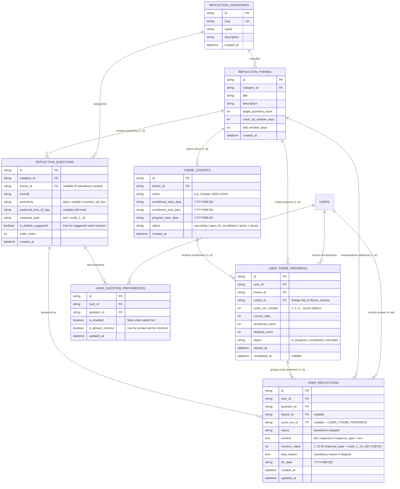

# Design: Personal Reflections System

## Technical Approach

Implement a complete, offline-first personal reflection journaling architecture:

1. **Shared Domain Layer (`@myself/shared`)**: Define `Category`, `Theme`, `ThemeCohort`, `Question`, `Reflection`, `ThemeCycleProgress`, and `UserQuestionPreference` contracts with Zod validation and Drizzle SQLite schemas in `packages/shared/src/modules/reflections/`.
2. **Pre-Loaded Seed Migrations**: Provide seed data for categories, thematic programs, cohorts (convocatorias), periodic questions (including default suggested routines and scale questions), and system rules (`catchUpWindowDays = 2`, `editWindowDays = 3`) bundled in `packages/shared/src/migrations/`.
3. **Mobile Ports & Adapters (`apps/mobile`)**:
   - `ReflectionRepositoryPort`: Implemented by `SqliteReflectionRepository` for atomic transactions (responses, skips, cohort enrollment, routine opt-out, ad-hoc pinning, cycle progression, history).
   - `NotificationServicePort`: Implemented by `ExpoNotificationsAdapter` for scheduling and canceling local reminders.
4. **Reactive State & UI (`apps/mobile`)**:
   - `useDailyReflections`: Manages the Unified Daily Queue (subscribed routine questions + active cohort steps + pinned shortcuts) with immediate opt-out capability.
   - `useThemeCohort`: Manages viewing available convocatorias, enrolling, advancing, skipping with reason, recovering, and historical reviews.
   - UI Components: `DailyReflectionQueue`, `PromptCard`, `ScaleSelector1To10`, `CohortEnrollmentCard`, `ReflectionModal`, `SkipReasonSheet`, `CycleProgressBadge`, `ReflectionHistoryView`.

---

## Architecture Decisions

| Decision                          | Option Chosen                                                             | Tradeoffs & Alternatives                                        | Rationale                                                                                                                              |
| --------------------------------- | ------------------------------------------------------------------------- | --------------------------------------------------------------- | -------------------------------------------------------------------------------------------------------------------------------------- |
| **Response Types**                | `response_type: 'text' \| 'scale_1_10'`                                   | _Alternative_: Free text only                                   | Supports quick numerical check-ins (1-10) alongside deep journaling.                                                                   |
| **Numeric Scale Response**        | Pure score (`numeric_value: 1..10`) without text notes                    | _Alternative_: Score + optional text notes                      | Keeps scale prompts fast, low-friction, and strictly quantitative.                                                                     |
| **Convocatorias / Cohortes**      | Explicit `THEME_COHORTS` entity                                           | _Alternative_: Dates embedded directly into `REFLECTION_THEMES` | Enables recording N historical convocatorias over time without duplicating questions or modifying the theme catalog.                   |
| **Routine Opt-Out & Shortcuts**   | Explicit `user_question_preferences` (`is_enabled`, `is_pinned_shortcut`) | _Alternative_: Hardcoded deletion of seed data                  | Allows user to opt-out of routines and pin ad-hoc questions as quick shortcuts in their daily view.                                    |
| **Catalog vs Admin App**          | Pre-loaded via database seeds                                             | _Alternative_: In-app admin CRUD & roles                        | Eliminates unnecessary mobile admin complexity; mobile focuses purely on reflection and participation.                                 |
| **Skip Representation**           | `status: 'answered' \| 'skipped'` with mandatory `skip_reason`            | _Alternative_: Deleting or ignoring skips                       | Keeps an honest, auditable log of why a question was skipped while allowing cycle advancement.                                         |
| **Missed Queue & Relative Dates** | FIFO (Earliest Deadline First) + `formatRelativeMissedDate`               | _Alternative_: LIFO / Raw ISO dates (`YYYY-MM-DD`)              | Eliminates raw DB leaks in UI, presents friendly urgency ("Ayer", "Anteayer · Vence hoy"), and ensures oldest items get cleared first. |
| **Active Cohorts Lifecycle**      | Retain `status IN ('in_progress', 'completed')` in active views           | _Alternative_: Instant removal upon step 7 answer               | Preserves celebration badge (`¡Ciclo Completado!`), stats, and the archive of completed steps.                                         |
| **Macro-Block Organization**      | Separate `Por Responder` and `Respondidas Hoy` with toggle switch         | _Alternative_: Single flat list of cards                        | Cleans visual noise, prevents clutter, and removes redundant check badges in the archive.                                              |

---

## Entity-Relationship Diagram (DER)



---

## Database Schema (Drizzle SQLite)

```typescript
// reflection_categories
export const reflectionCategories = sqliteTable("reflection_categories", {
  id: text("id").primaryKey(),
  slug: text("slug").notNull().unique(),
  name: text("name").notNull(),
  description: text("description"),
  createdAt: text("created_at").notNull(),
});

// reflection_themes
export const reflectionThemes = sqliteTable("reflection_themes", {
  id: text("id").primaryKey(),
  categoryId: text("category_id")
    .notNull()
    .references(() => reflectionCategories.id),
  title: text("title").notNull(),
  description: text("description"),
  targetQuestionCount: integer("target_question_count").notNull(),
  catchUpWindowDays: integer("catch_up_window_days").notNull().default(2),
  editWindowDays: integer("edit_window_days").notNull().default(3),
  createdAt: text("created_at").notNull(),
});

// theme_cohorts (Cohorts)
export const themeCohorts = sqliteTable("theme_cohorts", {
  id: text("id").primaryKey(),
  themeId: text("theme_id")
    .notNull()
    .references(() => reflectionThemes.id),
  name: text("name").notNull(),
  enrollmentStartDate: text("enrollment_start_date").notNull(),
  enrollmentEndDate: text("enrollment_end_date").notNull(),
  programStartDate: text("program_start_date").notNull(),
  status: text("status", {
    enum: ["upcoming", "open_for_enrollment", "active", "closed"],
  })
    .notNull()
    .default("upcoming"),
  createdAt: text("created_at").notNull(),
});

// reflection_questions
export const reflectionQuestions = sqliteTable("reflection_questions", {
  id: text("id").primaryKey(),
  categoryId: text("category_id")
    .notNull()
    .references(() => reflectionCategories.id),
  themeId: text("theme_id").references(() => reflectionThemes.id),
  prompt: text("prompt").notNull(),
  periodicity: text("periodicity", {
    enum: ["daily", "weekly", "monthly", "ad_hoc"],
  }).notNull(),
  preferredTimeOfDay: text("preferred_time_of_day"),
  responseType: text("response_type", { enum: ["text", "scale_1_10"] })
    .notNull()
    .default("text"),
  isDefaultSuggested: integer("is_default_suggested", { mode: "boolean" })
    .notNull()
    .default(false),
  orderIndex: integer("order_index").default(0),
  createdAt: text("created_at").notNull(),
});

// user_question_preferences (Opt-in / Opt-out & Shortcuts)
export const userQuestionPreferences = sqliteTable(
  "user_question_preferences",
  {
    id: text("id").primaryKey(),
    userId: text("user_id").notNull(),
    questionId: text("question_id")
      .notNull()
      .references(() => reflectionQuestions.id),
    isEnabled: integer("is_enabled", { mode: "boolean" })
      .notNull()
      .default(true),
    isPinnedShortcut: integer("is_pinned_shortcut", { mode: "boolean" })
      .notNull()
      .default(false),
    updatedAt: text("updated_at").notNull(),
  },
);

// user_theme_progress (Cycle runs tied to cohorts)
export const userThemeProgress = sqliteTable("user_theme_progress", {
  id: text("id").primaryKey(),
  userId: text("user_id").notNull(),
  themeId: text("theme_id")
    .notNull()
    .references(() => reflectionThemes.id),
  cohortId: text("cohort_id")
    .notNull()
    .references(() => themeCohorts.id),
  cycleRunNumber: integer("cycle_run_number").notNull().default(1),
  currentStep: integer("current_step").notNull().default(1),
  answeredCount: integer("answered_count").notNull().default(0),
  skippedCount: integer("skipped_count").notNull().default(0),
  status: text("status", { enum: ["in_progress", "completed"] })
    .notNull()
    .default("in_progress"),
  startedAt: text("started_at").notNull(),
  completedAt: text("completed_at"),
});

// user_reflections (Answers, Scores & Skips)
export const userReflections = sqliteTable("user_reflections", {
  id: text("id").primaryKey(),
  userId: text("user_id").notNull(),
  questionId: text("question_id")
    .notNull()
    .references(() => reflectionQuestions.id),
  themeId: text("theme_id").references(() => reflectionThemes.id),
  cycleRunId: text("cycle_run_id").references(() => userThemeProgress.id),
  status: text("status", { enum: ["answered", "skipped"] })
    .notNull()
    .default("answered"),
  content: text("content"), // populated if text
  numericValue: integer("numeric_value"), // populated if scale_1_10 (1..10)
  skipReason: text("skip_reason"),
  forDate: text("for_date").notNull(),
  createdAt: text("created_at").notNull(),
  updatedAt: text("updated_at").notNull(),
});
```

---

## File Changes

| File                                                   | Action        | Description                                                                            |
| ------------------------------------------------------ | ------------- | -------------------------------------------------------------------------------------- |
| `packages/shared/src/modules/reflections/schema.ts`    | Create        | Drizzle SQLite table definitions including `responseType` and `numericValue`           |
| `packages/shared/src/modules/reflections/types.ts`     | Create        | Zod domain schemas and TypeScript models                                               |
| `packages/shared/src/modules/reflections/index.ts`     | Create        | Module public exports                                                                  |
| `packages/shared/src/modules/index.ts`                 | Modify        | Re-export reflections module                                                           |
| `packages/shared/src/migrations/`                      | Create/Modify | Migration SQL containing tables and seed content with cohorts & scale prompts          |
| `apps/mobile/src/features/reflections/domain/ports/`   | Create        | Repository and Notification ports                                                      |
| `apps/mobile/src/features/reflections/infrastructure/` | Create        | SQLite repository and Expo notification adapters                                       |
| `apps/mobile/src/features/reflections/hooks/`          | Create        | `useDailyReflections`, `useThemeCohort`, `useReflectionHistory`                        |
| `apps/mobile/src/features/reflections/components/`     | Create        | PromptCard, ScaleSelector1To10, CohortEnrollmentCard, ReflectionModal, SkipReasonSheet |
| `apps/mobile/src/app/(tabs)/reflections.tsx`           | Create        | Reflections tab screen                                                                 |
| `apps/mobile/src/app/(tabs)/_layout.tsx`               | Modify        | Add Reflections tab trigger                                                            |

---

## Testing Strategy

| Layer           | Target                                       | Approach                                                                                |
| --------------- | -------------------------------------------- | --------------------------------------------------------------------------------------- |
| **Unit**        | Zod schemas & domain logic                   | Test text vs scale 1-10 validation, cohort enrollment rules, opt-out & pinning toggling |
| **Integration** | `SqliteReflectionRepository`                 | Test save text reflection, save scale score, skip with reason, cohort advance           |
| **Component**   | `DailyReflectionQueue`, `ScaleSelector1To10` | Test queue rendering, score selection, skip sheet trigger                               |

---

## Threat Matrix

`N/A — no routing, shell, subprocess, VCS/PR automation, executable-file classification, or process-integration boundary.`

---

## Migration / Rollout

Tables and curated seed data will be initialized via `SHARED_MIGRATIONS` during `initDatabase` at application launch.
